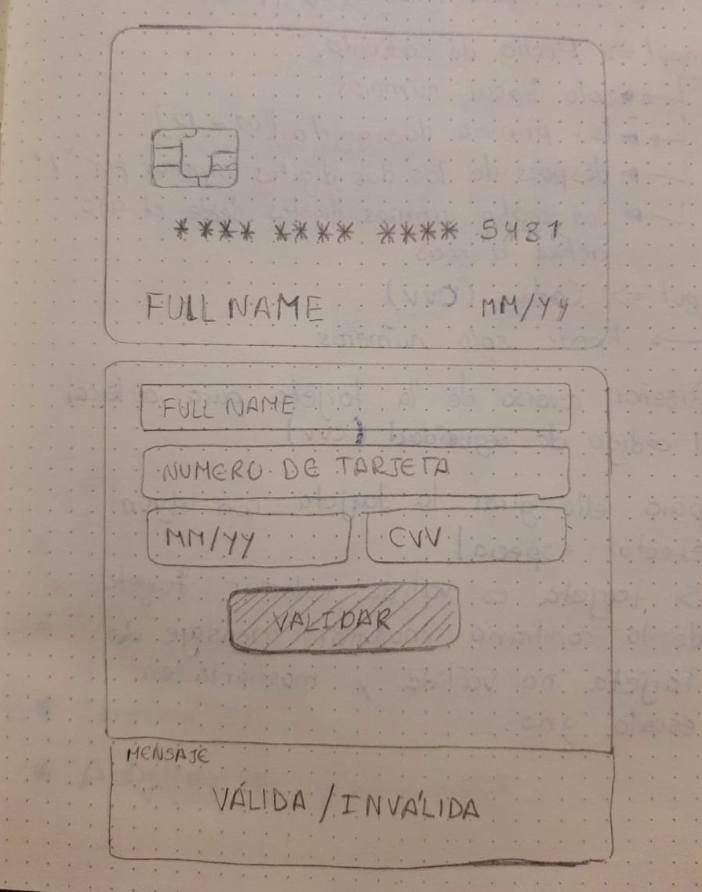
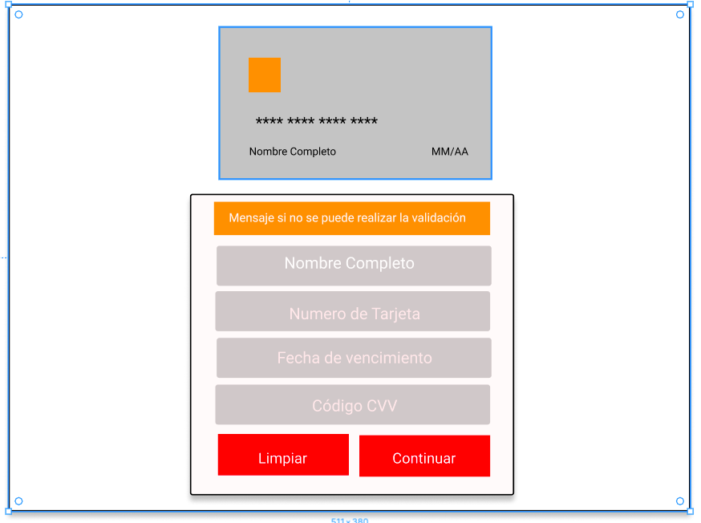
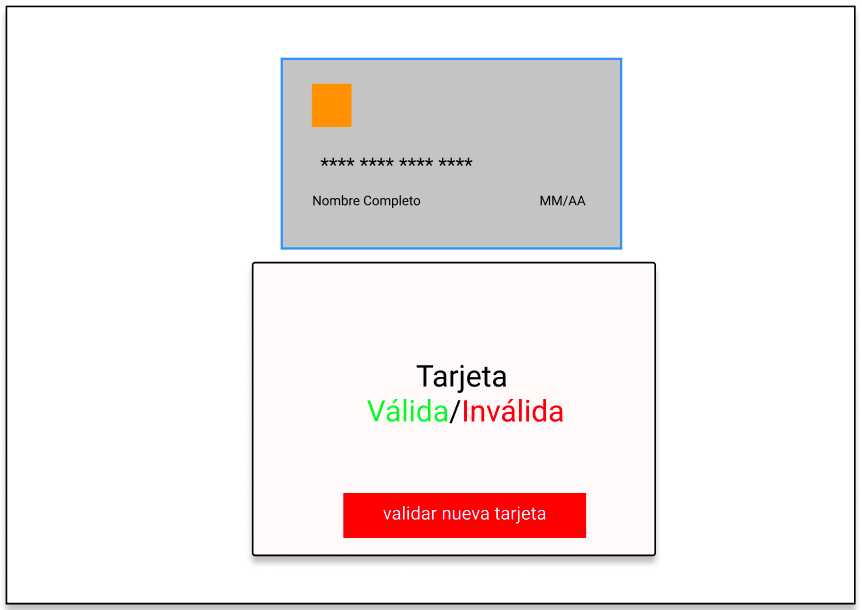

# Tarjeta de crédito válida

### Resumen
* Este proyecto consiste en determinar si una tarjeta de crédito o débito es válida utilizando el algoritmo de Luhn. Además, oculta los números de la tarjeta con el símbolo '#' con excepción de los 4 últimos dígitos.

### Proyecti final
* Pendiente
### Investigación UX

  1. Los usuarios serian toda aquella persona que habitualmente hace  uso de tarjetas de crédito o debito para realizar transacciones o compras online. Por tal motivo el objetivo de este trabajo es dar la posibilidad al usuario de poder comprobar si su tarjeta es válida o no con tan solo ingresar el número de tarjeta. Además, garantizar la seguridad del cliente ocultado los primero 12 dígitos de la tarjeta.
  2. La solución en el que este trabajo se basa es muy simple, para ello se emplea el algoritmo de Luhn que solo requiere del número de tarjeta. Este trabjo no almacena niguna información de los datos ingresados.
  3. Prototipo en papel
  
  1. En la etapa del feedback recibi la observacion sobre la posibilidad de volver a validar una tarjeta nueva si es que el usuario asi lo desea y para ello era necesaria la existencia de un boton que permitiera regresar al formulario con los campos limpios para ingresar los nuevos datos, asi mismo tambien mostrar un mensaje de alerta cuando todos los campos de entrada no son completados. 
    
  2. pendiente 

